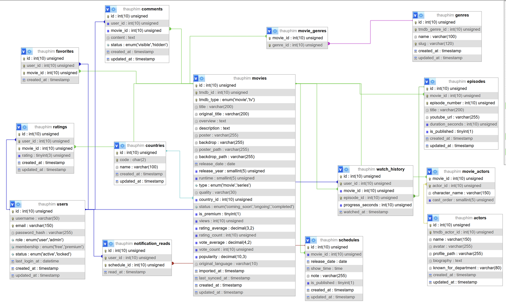

# ThauPhim - Online Movie Streaming Website

ThauPhim la website xem phim truc tuyen cho do an Lap trinh Web. Du an dung PHP, MySQL/MariaDB, HTML, CSS va JavaScript, gom giao dien nguoi dung, API JSON noi bo, trang quan tri va cong cu import metadata tu TMDB.

## 1. Luong du lieu

```text
TMDB API
-> tools/import_tmdb.php
-> MySQL database
-> PHP API trong /api
-> Website user + Admin
```

TMDB chi dung de import metadata ban dau. Sau khi import, MySQL la nguon du lieu chinh. Frontend khong goi TMDB truc tiep va khong expose `TMDB_API_KEY`.

Video xem phim/tap phim duoc luu trong `episodes.youtube_url`. Admin nhap URL YouTube dang `watch`, `youtu.be`, `shorts/live` hoac `embed`; form admin se chuan hoa ve link embed.

## 2. Cong nghe

- PHP 8+
- MySQL/MariaDB
- PDO prepared statements
- Session-based authentication
- HTML5, CSS3, JavaScript ES6
- TMDB API de import metadata
- YouTube iframe de phat video
- Font Awesome icons

## 3. Trang thai hien tai

| Hang muc | Trang thai | Ghi chu |
| --- | --- | --- |
| Schema MySQL | Done | `database/schema.sql` |
| Seed admin | Done | `database/seed.sql` tao admin mac dinh |
| Config mau | Done | `includes/config.example.php` |
| Import TMDB | Done | `tools/import_tmdb.php` import metadata phim le/phim bo |
| API doc MySQL | Done | Cac endpoint trong `/api` |
| Trang chu/danh sach/loc | Done | Doc du lieu tu API/MySQL |
| Trang chi tiet phim | Done | Hien genres, actors, episodes, favorite/comment/rating |
| Trang xem phim | Done | YouTube iframe, chuyen tap, luu tien do xem |
| Dang ky/dang nhap/dang xuat | Done | Dung bang `users`, `password_hash`, session |
| Quen mat khau | Done | Dung reset token gui qua email, het han sau 60 phut |
| Trang tai khoan | Done | Tong quan, phim yeu thich, lich su xem |
| Admin dashboard | Done | Guard bang role admin |
| Admin CRUD movies/episodes | Done | Co nhap/publish YouTube URL |
| Admin CRUD genres/countries/actors | Done | Co create/edit/delete/list |
| Admin users/comments/ratings | Done | Quan ly membership/status, an/xoa comment, xem/xoa rating |
| Deploy docs | Done | `deploy/DEPLOYMENT.md`, `.htaccess` va vhost mau |

## 4. Chuc nang chinh

### Website user

- Trang chu voi banner, danh sach phim moi, phim le, phim bo.
- Duyet phim, tim kiem, loc theo the loai/quoc gia/nam/loai phim.
- Trang quoc gia va trang dien vien.
- Trang chi tiet phim voi poster, backdrop, metadata, dien vien, the loai, tap phim, phim lien quan.
- Trang xem phim bang YouTube iframe.
- Dang ky, dang nhap, dang xuat.
- Tai khoan nguoi dung: thong ke, phim yeu thich, lich su xem.
- Yeu thich phim.
- Binh luan phim.
- Danh gia 1-5 sao.
- Luu tien do xem theo episode.
- Kiem tra phim premium/free theo membership.

### Admin

- Dashboard tong quan.
- CRUD movies.
- CRUD episodes va YouTube URL.
- CRUD genres.
- CRUD countries.
- CRUD actors.
- Quan ly users: membership va status.
- Quan ly comments: an hoac xoa.
- Quan ly ratings: xem/xoa.

## 5. Cai dat local voi XAMPP

### 5.1 Chuan bi config

Copy file cau hinh mau:

```powershell
Copy-Item includes\config.example.php includes\config.php
```

Cap nhat `includes/config.php`:

```php
define("APP_BASE_PATH", "/");
define("APP_DEBUG", true);

define("TMDB_API_KEY", "your-tmdb-api-key");

define("DB_HOST", "localhost");
define("DB_PORT", 3306);
define("DB_NAME", "thauphim");
define("DB_USER", "root");
define("DB_PASS", "");
define("DB_CHARSET", "utf8mb4");

define("APP_URL", "https://fnbstore.store/");
define("MAIL_DRIVER", "smtp");
define("MAIL_FROM", "thauphim@fnbstore.store");
define("MAIL_FROM_NAME", "ThauPhim");
define("SMTP_HOST", "smtp.fnbstore.store");
define("SMTP_PORT", 465);
define("SMTP_ENCRYPTION", "ssl");
define("SMTP_USERNAME", "thauphim@fnbstore.store");
define("SMTP_PASSWORD", "replace-with-smtp-password");
```

Không commit mật khẩu SMTP thật. Đặt biến môi trường `SMTP_PASSWORD` hoặc tạo file local `includes/config.local.php`:

```php
<?php
define("SMTP_PASSWORD", "your-real-smtp-password");
```

SMTP cần PHPMailer qua `vendor/autoload.php`:

```powershell
composer install
```

Kiem tra cau hinh email reset ma khong gui email:

```powershell
D:\Xampp\php\php.exe tools\diagnose_password_reset_mail.php user@example.com
```

Neu chay trong subfolder cua Apache, cap nhat `APP_BASE_PATH` theo duong dan public cua project.

### 5.2 Tao database va seed admin

```powershell
D:\Xampp\mysql\bin\mysql.exe -uroot -P3306 --default-character-set=utf8mb4 -e "SOURCE D:/Xampp/htdocs/thauphim-movie-website/database/schema.sql; SOURCE D:/Xampp/htdocs/thauphim-movie-website/database/seed.sql;"
```

### 5.3 Import metadata TMDB

```powershell
D:\Xampp\php\php.exe tools\import_tmdb.php
```

Script import se:

- Goi cac endpoint TMDB popular/top rated/now playing/upcoming/trending cho movie va tv.
- Luu movie/series vao MySQL.
- Luu genres, countries, actors va bang lien ket.
- Chong trung bang unique key `tmdb_id + tmdb_type`.
- Khong tao episode va khong tu gan YouTube URL.
- Dung som neu database da co du 100 phim/phim bo.

### 5.4 Mo website

Neu project nam tai:

```text
D:\Xampp\htdocs\thauphim-movie-website
```

Co the mo:

```text
http://localhost/thauphim-movie-website/
```

Hoac cau hinh virtual host theo `deploy/apache-vhost.example.conf`.

## 6. Tai khoan demo

```text
Admin:
Username: admin
Email: admin@thauphim.local
Password: admin123
```

Nen doi mat khau admin khi deploy that.

## 7. API noi bo

Tat ca API tra JSON.

Thanh cong:

```json
{
  "success": true,
  "data": {},
  "meta": {
    "page": 1,
    "limit": 20,
    "total": 100
  }
}
```

Loi:

```json
{
  "success": false,
  "message": "Thong bao loi"
}
```

### Endpoint danh sach phim va metadata

| Endpoint | Method | Chuc nang |
| --- | --- | --- |
| `/api/movies.php` | GET | Danh sach phim, tim kiem, loc, sap xep, phan trang |
| `/api/movie-detail.php?id=1` | GET | Chi tiet phim, genres, actors, episodes |
| `/api/genres.php` | GET | Danh sach the loai |
| `/api/countries.php` | GET | Danh sach quoc gia |
| `/api/actors.php` | GET | Danh sach dien vien, co phan trang |
| `/api/episodes.php?movie_id=1` | GET | Danh sach tap phim da publish |
| `/api/movies-by-country.php?code=US` | GET | Phim theo ma quoc gia |

Query ho tro cho `/api/movies.php`:

```text
type=movie|series
genre_id=1
country=US
year=2026
q=spider
sort=newest|popular|top_rated|most_viewed
limit=20
page=1
```

### Endpoint tuong tac user

| Endpoint | Method | Chuc nang |
| --- | --- | --- |
| `/api/favorites.php?movie_id=1` | GET | Lay trang thai yeu thich cua user hien tai |
| `/api/favorites.php` | POST | Toggle yeu thich phim |
| `/api/comments.php?movie_id=1` | GET | Lay comment visible cua phim |
| `/api/comments.php` | POST | Them comment, can dang nhap |
| `/api/comments.php` | DELETE | Xoa comment cua chinh user hoac admin |
| `/api/ratings.php?movie_id=1` | GET | Lay diem trung binh va diem cua user hien tai |
| `/api/ratings.php` | POST | Tao/cap nhat danh gia 1-5 sao |
| `/api/update-watch-history.php` | POST | Luu tien do xem episode |

Payload mau:

```json
{
  "movie_id": 1,
  "episode_id": 2,
  "progress_seconds": 120
}
```

## 8. Database

So do quan he database:



Mo hinh database dat `movies` lam bang trung tam. Metadata phim duoc lien ket voi `genres`, `countries`, `actors`, `episodes` va cac bang tuong tac nguoi dung. Cac bang trung gian `movie_genres` va `movie_actors` giup mot phim co nhieu the loai va nhieu dien vien. Cac bang `favorites`, `comments`, `ratings` va `watch_history` luu hanh vi cua user theo tung phim/tap phim. Bang `schedules` quan ly lich/phim sap chieu, con `notification_reads` luu trang thai user da doc thong bao lich chieu.

Bang chinh:

- `users`: tai khoan, role, membership, status.
- `password_resets`: token dat lai mat khau, het han va dung mot lan.
- `movies`: metadata phim, TMDB id/type, poster/backdrop, type movie/series, rating, premium.
- `episodes`: tap phim, YouTube URL, publish state.
- `genres`: the loai.
- `countries`: quoc gia.
- `actors`: dien vien.
- `movie_genres`: lien ket phim-the loai.
- `movie_actors`: lien ket phim-dien vien.
- `schedules`: lich/thong bao phim sap chieu.
- `notification_reads`: trang thai da doc thong bao lich chieu theo user.
- `favorites`: phim yeu thich.
- `watch_history`: lich su va tien do xem.
- `comments`: binh luan.
- `ratings`: danh gia 1-5 sao.

Ghi chu quan trong:

- `movies.tmdb_id + movies.tmdb_type` la unique key chong import trung.
- `movies.type` dung cho website: `movie` hoac `series`.
- `movies.tmdb_type` dung theo TMDB: `movie` hoac `tv`.
- `episodes.youtube_url` co the rong khi moi import.
- Chi episode co `is_published = 1` moi nen hien cho user qua API.
- Moi user chi co mot rating cho moi phim.
- Moi user chi co mot record watch history cho moi episode.

## 9. Cau truc thu muc

```text
thauphim-movie-website/
|-- admin/
|   |-- dashboard.php
|   |-- movies/
|   |-- episodes/
|   |-- genres/
|   |-- countries/
|   |-- actors/
|   |-- users/
|   |-- comments/
|   |-- ratings/
|
|-- api/
|   |-- _helpers.php
|   |-- movies.php
|   |-- movie-detail.php
|   |-- genres.php
|   |-- countries.php
|   |-- actors.php
|   |-- episodes.php
|   |-- movies-by-country.php
|   |-- favorites.php
|   |-- comments.php
|   |-- ratings.php
|   |-- update-watch-history.php
|
|-- assets/
|   |-- css/
|   |-- js/
|   |-- images/
|   |   |-- database-diagram.png
|
|-- database/
|   |-- schema.sql
|   |-- seed.sql
|
|-- deploy/
|   |-- DEPLOYMENT.md
|   |-- htaccess.example
|   |-- apache-vhost.example.conf
|
|-- includes/
|   |-- config.php
|   |-- config.example.php
|   |-- db.php
|   |-- auth.php
|   |-- header.php
|   |-- footer.php
|   |-- functions.php
|
|-- pages/
|   |-- movie-detail.php
|   |-- watch.php
|   |-- account.php
|   |-- country.php
|   |-- actor.php
|
|-- tools/
|   |-- import_tmdb.php
|
|-- index.php
|-- login.php
|-- register.php
|-- logout.php
|-- README.md
```

## 10. Kiem tra nhanh

### Database/import

```sql
SELECT COUNT(*) FROM movies;
SELECT type, COUNT(*) FROM movies GROUP BY type;
SELECT COUNT(*) FROM genres;
SELECT COUNT(*) FROM actors;
SELECT COUNT(*) FROM movie_genres;
SELECT COUNT(*) FROM movie_actors;
SELECT tmdb_id, tmdb_type, COUNT(*)
FROM movies
GROUP BY tmdb_id, tmdb_type
HAVING COUNT(*) > 1;
```

Ket qua mong muon sau import mac dinh:

```text
movies: 100
movie: gan 50
series: gan 50
duplicate tmdb_id + tmdb_type: 0
episodes: co the rong neu admin chua tao
```

### API

- `/api/movies.php?type=movie`
- `/api/movies.php?type=series`
- `/api/movies.php?q=test`
- `/api/movies.php?sort=popular`
- `/api/movie-detail.php?id=1`
- `/api/episodes.php?movie_id=1`
- `/api/genres.php`
- `/api/countries.php`
- `/api/actors.php?limit=5`
- `/api/movies-by-country.php?code=US`

### User/admin

- Dang ky user moi.
- Dang nhap/dang xuat.
- Admin dang nhap bang tai khoan seed.
- Admin tao movie.
- Admin tao episode voi YouTube URL va tick publish.
- Trang chi tiet hien episode da publish.
- Trang xem phim phat iframe YouTube.
- User them yeu thich, binh luan, danh gia.
- User xem lai tai khoan, favorites va history.

## 11. Bao mat

- Mat khau hash bang `password_hash()`.
- Dang nhap kiem tra bang `password_verify()`.
- Quen mat khau dung reset token hash, het han sau 60 phut va chi dung mot lan.
- Truy van DB dung PDO prepared statements.
- Validate input tu form va query API.
- Escape output bang `htmlspecialchars()`.
- Kiem tra role admin truoc khi vao `/admin`.
- Kiem tra user locked truoc khi cho dang nhap.
- Kiem tra membership khi xem phim premium.
- Chi cho user dang nhap favorite/comment/rating/history.
- Validate YouTube URL truoc khi luu episode.
- Khong dua `TMDB_API_KEY` vao JavaScript frontend.

## 12. Deploy

Xem chi tiet trong:

```text
deploy/DEPLOYMENT.md
```

Checklist tom tat:

- Tao database va user MySQL tren hosting.
- Copy `includes/config.example.php` thanh `includes/config.php`.
- Cap nhat `APP_BASE_PATH`, `APP_URL`, database credentials, `TMDB_API_KEY` va SMTP credentials.
- Import `database/schema.sql`.
- Import `database/seed.sql`.
- Neu database da ton tai va chi can nang cap chuong thong bao lich chieu, import `database/notification_upgrade.sql` trong dung database dang duoc cau hinh.
- Neu database da ton tai va can bo sung quen mat khau, import `database/password_reset_upgrade.sql` trong dung database dang duoc cau hinh.
- Import data TMDB bang CLI neu hosting cho phep, hoac import local roi export SQL data.
- Cau hinh web root/vhost/.htaccess theo moi truong.
- Kiem tra API, trang user va trang admin.
- Doi mat khau admin mac dinh.

## 13. San pham ban giao

- Source code website.
- Database schema va seed.
- Script import TMDB.
- API PHP trong `/api`.
- Trang admin.
- Huong dan deploy.
- README.
- So do database ERD.
- Tai khoan demo admin.
- Anh chup man hinh va bao cao do an neu can nop kem.
